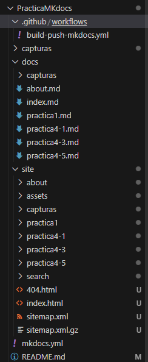
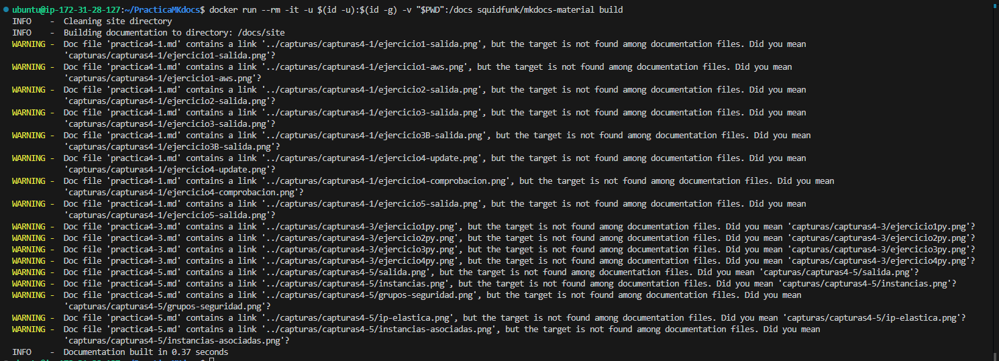

# PracticaMKdocs

## Paso 0. Estructura (se irá creando siguiendo mis pasos)

## Paso 1. Crear nuevo proyecto
Para crear toda la estructura necesaria para MKDocs nos pondremos en la raíz de la práctica (PracticaMKDocs) y ejecutaremos el siguiente comando
```bash
docker run --rm -it -p 8000:8000 -u $(id -u):$(id -g) -v "$PWD":/docs squidfunk/mkdocs-material new .
```
Esto nos creará el archivo mkdocs.yml que será importante para después.

## Paso 2. Configurar archivo mkdocs.yml
```bash
site_name: Antonio Jesus Cortes Lopez
nav:
    - Principal: index.md
    - Acerca de: about.md
    - Practica 1: practica1.md
    - Practica 4.1: practica4-1.md
    - Practica 4.3: practica4-3.md
    - Practica 4.5: practica4-5.md
theme: material
```
Aqui establezco los readme de las prácticas anteriores (4.1, 4.3, 4.5).
Luego debemos establecer cada uno de estos archivos en el directorio /docs/
## Paso 3. Creamos la página web automáticamente con el script
```bash
docker run --rm -it -u $(id -u):$(id -g) -v "$PWD":/docs squidfunk/mkdocs-material build
```
Con esto ejecutamos un docker para construir un sitio web estático con MkDocs y el tema Material.

## Paso 4. Creación de Workflow para GitHub Actions
El archivo que debemos de tener se llama 'build-push-mkdocs.yml' y debe de tener el siguiente contenido:
```bash
name: build-push-mkdocs

# Eventos que desescandenan el workflow
on:
  push:
    branches: ["main"]

  workflow_dispatch:

# A workflow run is made up of one or more jobs that can run sequentially or in parallel
jobs:

  # Job para crear la documentación de mkdocs
  build:
    # Indicamos que este job se ejecutará en una máquina virtual con la última versión de ubuntu
    runs-on: ubuntu-latest
    
    # Definimos los pasos de este job
    steps:
      - name: Clone repository
        uses: actions/checkout@v4

      - name: Install Python3
        uses: actions/setup-python@v4
        with:
          python-version: 3.x

      - name: Install Mkdocs
        run: |
          pip install mkdocs
          pip install mkdocs-material 

      - name: Build MkDocs
        run: |
          mkdocs build

      - name: Push the documentation in a branch
        uses: s0/git-publish-subdir-action@develop
        env:
          REPO: self
          BRANCH: gh-pages # The branch name where you want to push the assets
          FOLDER: site # The directory where your assets are generated
          GITHUB_TOKEN: ${{ secrets.GITHUB_TOKEN }} # GitHub will automatically add this - you don't need to bother getting a token
          MESSAGE: "Build: ({sha}) {msg}" # The commit message
```
## Paso 5. Modificar los permisos de nuestro workflow dentro de nuestro repositorio de GitHub
Hay que meterse en Settings, Actions, General y modificar las "Workflow Permissions" para activar "Read and Write"

Vamos a comprobarlo:


## Paso 6. Comprobaciones
### Paso 6.1 Comprobaciones desde localhost
Práctica 4.1

Práctica 4.3

Práctica 4.5

### Paso 6.1 Comprobaciones desde mi página web de github.io
Práctica 4.1

Práctica 4.3

Práctica 4.5


## URL de la página web creada :
https://antoniocl1.github.io/PracticaMKdocs/