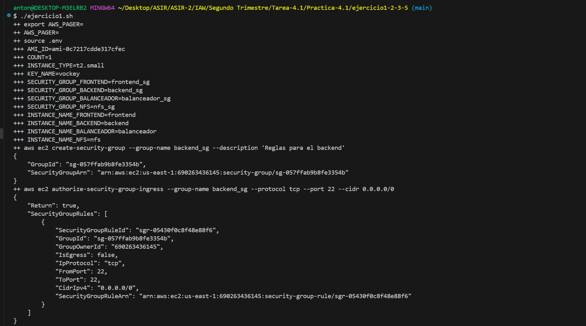
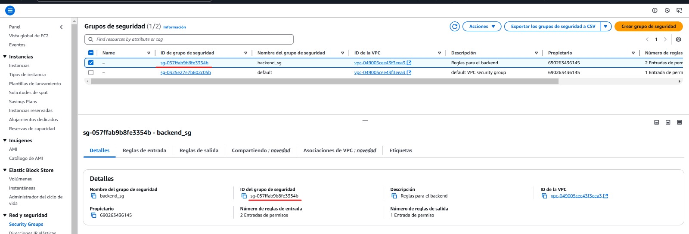
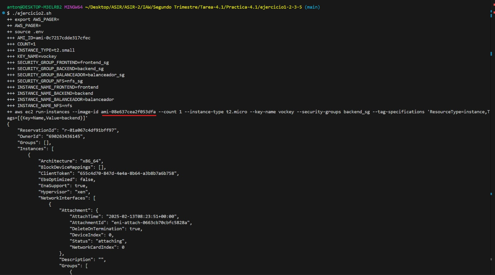
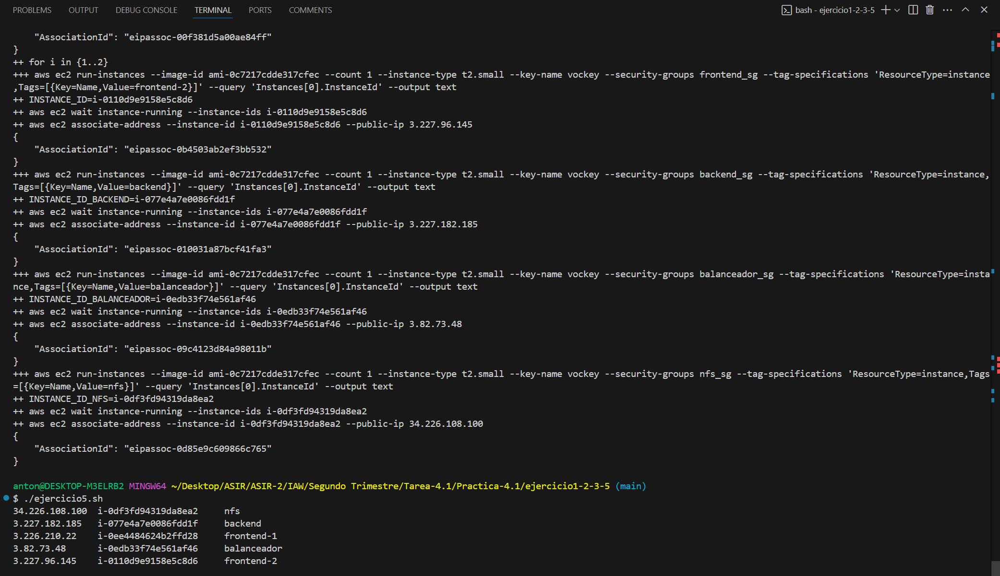
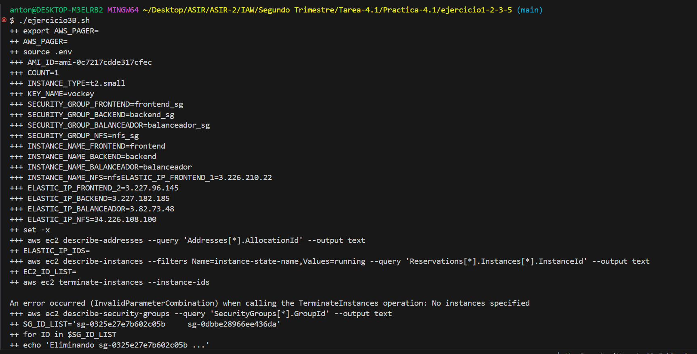
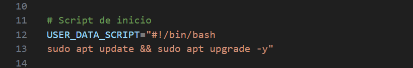
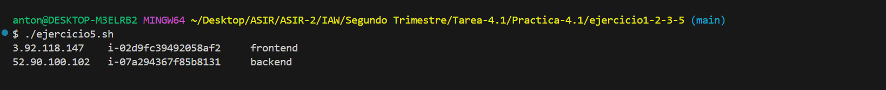
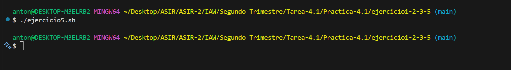

# Practica-4.1
2º ASIR

# 1.19.1 Ejercicio 1
## Crea un grupo de seguridad para las máquinas del Backend con el nombre backend-sg.
### Añada las siguientes reglas al grupo de seguridad:
- Acceso SSH (puerto 22/TCP) desde cualquier dirección IP.
- Acceso al puerto 3306/TCP desde cualquier dirección IP.

# 1.19.2 Ejercicio 2
## Crea una instancia EC2 para la máquina del Backend con las siguientes características.
- Identificador de la AMI: ami-08e637cea2f053dfa. Esta AMI se corresponde con la imagen Red Hat Enterprise Linux 9 (HVM).
- Número de instancias: 1
- Tipo de instancia: t2.micro
- Clave privada: vockey
- Grupo de seguridad: backend-sg
- Nombre de la instancia: backend

# 1.19.3 Ejercicio 3
## Crear un script para crear la infraestructura de la práctica propuesta por el profesor.

(Compruebo con el ejercicio 5 que se han creado)
## Crear un script para eliminar la infraestructura de la práctica propuesta por el profesor.

(La que no me está dejando eliminar es el grupo de seguridad Default "en principio es algo normal")

# 1.19.4 Ejercicio 4
### Modifique los scripts del repositorio de ejemplo:
#### *https://github.com/josejuansanchez/practica-aws-cli*

# 1.19.5 Ejercicio 5
## Escriba un script de bash que muestre el nombre de todas instancias EC2 que tiene en ejecución junto a su dirección IP pública.

# 1.19.6 Ejercicio 6
### Modifique los scripts del repositorio de ejemplo:
#### *https://github.com/josejuansanchez/practica-aws-cli*
He tomado el trabajo realizado en el ejercicio 3 y lo he dividido en distintos scripts, siguiendo la estructura del repositorio de referencia.