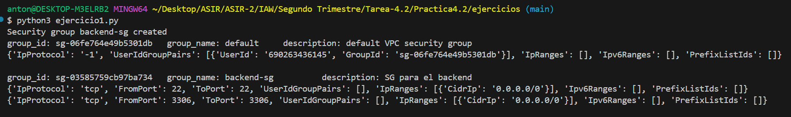
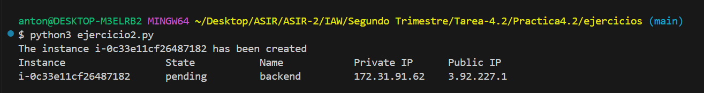
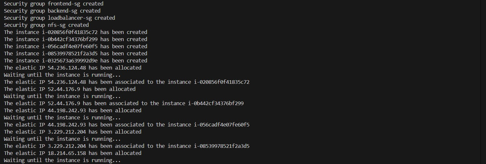
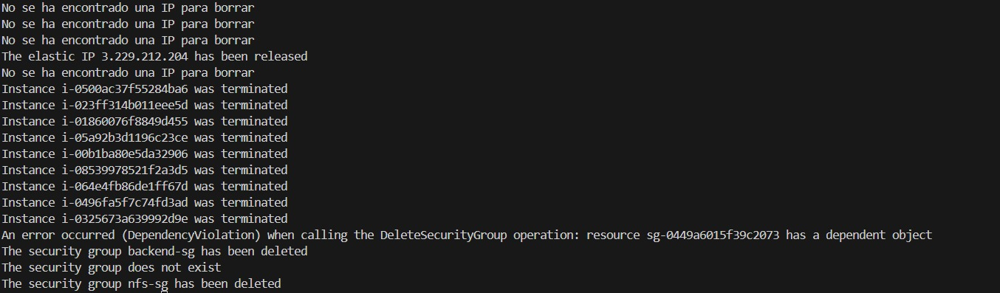

# Practica4.3
IAW 2º ASIR
# Ejercicio1
```python
from common import aws_resource_functions as aws

# Hacer las reglas de entrada del grupo de seguridad
ingress_permissions = [
    {'CidrIp': '0.0.0.0/0', 'IpProtocol': 'tcp', 'FromPort': 22, 'ToPort': 22},
    {'CidrIp': '0.0.0.0/0', 'IpProtocol': 'tcp', 'FromPort': 3306, 'ToPort': 3306}
]

# Definir el nombre y la descripción del grupo de seguridad
sg_name = 'backend-sg'
sg_description = 'SG para el backend'

# Crear el grupo de seguridad
aws.create_security_group(sg_name, sg_description, ingress_permissions)

# Listar los grupos de seguridad
aws.list_security_groups()
```

# Ejercicio2
```python
from common import aws_resource_functions as aws

# AMI ID
ami = 'ami-08e637cea2f053dfa'

# Instance type
instance_type = 't2.micro'

# SSH key name
key_name = 'vockey'

# Instance name and security group name
instance_name = 'backend'
sg_name = 'backend-sg'

# Verificar si el grupo de seguridad existe
if aws.security_group_exists(sg_name) == False:
    print('El grupo de seguridad no existe')
    exit()

# Crear la instancia
aws.create_instance(ami, 1, instance_type, key_name, instance_name, sg_name)

# Listar las instancias
aws.list_instances()
```

# Ejercicio3A
```python
from common import aws_resource_functions as aws
import boto3
import time

# AMI ID
ami = 'ami-04b4f1a9cf54c11d0'

# Tipo de instancia
instance_type = 't2.micro'

# Nombre de la clave SSH
key_name = 'vockey'

# Nombres de las instancias y grupos de seguridad
nombres_instancias = ['frontend-1', 'frontend-2', 'backend', 'balanceador', 'nfs']
nombres_sg = ['frontend-sg', 'frontend-sg', 'backend-sg', 'balanceador-sg', 'nfs-sg']

# Reglas de los grupos de seguridad para las instancias..
reglas_sg = {
    'frontend-sg': [
        {'IpProtocol': 'tcp', 'FromPort': 22, 'ToPort': 22, 'CidrIp': '0.0.0.0/0'},
        {'IpProtocol': 'tcp', 'FromPort': 2049, 'ToPort': 2049, 'CidrIp': '0.0.0.0/0'},
        {'IpProtocol': 'tcp', 'FromPort': 80, 'ToPort': 80, 'CidrIp': '0.0.0.0/0'},
        {'IpProtocol': 'tcp', 'FromPort': 443, 'ToPort': 443, 'CidrIp': '0.0.0.0/0'},
        {'IpProtocol': 'tcp', 'FromPort': 3306, 'ToPort': 3306, 'CidrIp': '0.0.0.0/0'}
    ],
    'backend-sg': [
        {'IpProtocol': 'tcp', 'FromPort': 22, 'ToPort': 22, 'CidrIp': '0.0.0.0/0'},
        {'IpProtocol': 'tcp', 'FromPort': 3306, 'ToPort': 3306, 'CidrIp': '0.0.0.0/0'}
    ],
    'balanceador-sg': [
        {'IpProtocol': 'tcp', 'FromPort': 22, 'ToPort': 22, 'CidrIp': '0.0.0.0/0'},
        {'IpProtocol': 'tcp', 'FromPort': 3306, 'ToPort': 3306, 'CidrIp': '0.0.0.0/0'},
        {'IpProtocol': 'tcp', 'FromPort': 80, 'ToPort': 80, 'CidrIp': '0.0.0.0/0'},
        {'IpProtocol': 'tcp', 'FromPort': 443, 'ToPort': 443, 'CidrIp': '0.0.0.0/0'},
        {'IpProtocol': 'tcp', 'FromPort': 2049, 'ToPort': 2049, 'CidrIp': '0.0.0.0/0'}
    ],
    'nfs-sg': [
        {'IpProtocol': 'tcp', 'FromPort': 22, 'ToPort': 22, 'CidrIp': '0.0.0.0/0'},
        {'IpProtocol': 'tcp', 'FromPort': 2049, 'ToPort': 2049, 'CidrIp': '0.0.0.0/0'}
    ]
}

# Crear los grupos de seguridad si no existen ya.
for nombre_sg, reglas in reglas_sg.items():
    if not aws.security_group_exists(nombre_sg):
        aws.create_security_group(nombre_sg, f'Reglas para {nombre_sg}', reglas)

# Crear las IPs elásticas.
ips_elasticas = {}
for nombre_instancia in nombres_instancias:
    ip_elastica = aws.allocate_elastic_ip()
    ips_elasticas[nombre_instancia] = ip_elastica

# Crear las instancias y asociar las IPs elásticas a las instancias creadas. 
for nombre_instancia, nombre_sg in zip(nombres_instancias, nombres_sg):
    aws.create_instance(ami, 1, instance_type, key_name, nombre_instancia, nombre_sg)
    id_instancia = aws.get_instance_id(nombre_instancia)
    
    # Esperar hasta que la instancia esté en estado 'running' para asociar la IP elástica.
    ec2 = boto3.resource('ec2')
    instance = ec2.Instance(id_instancia)
    instance.wait_until_running()
    
    # Asociar la IP elástica a la instancia.
    aws.associate_elastic_ip(ips_elasticas[nombre_instancia], id_instancia)
```

# Ejercicio3B
```python
from common.aws_resource_class import AWS

# Creamos el objeto AWS
aws = AWS()

#Variables instancias
instance_name = ["frontend-1", 
                 "frontend-2", 
                 "balanceador", 
                 "backend", 
                 "nfs"]

# Eliminar IPs
def delete_IP(instance_name):
    try:
        instance_id = aws.get_instance_id(instance_name)
        elastic_ip = aws.get_instance_public_ip(instance_id)
        aws.release_elastic_ip(elastic_ip)
    except:
        print("No se ha encontrado una IP para borrar")

for i in range(len(instance_name)):
    delete_IP(instance_name[i])

# Eliminar instancias
def delete_instances(instance_name):
    aws.terminate_instance(instance_name)

for i in range(len(instance_name)):
    delete_instances(instance_name[i])

#Variables grupos de seguridad
sg_name = ["frontend-sg", 
           "backend-sg", 
           "balanceador-sg", 
           "nfs-sg"]

# Eliminar grupos de seguridad
def delete_sg(sg_name):
    aws.delete_security_group(sg_name)

for i in range(len(sg_name)):
    delete_sg(sg_name[i])
```

**El error que nos da pasa después de ejecutar muchas veces el script, supongo que al AWS le cuesta procesar todas las creaciones y borrados que estoy haciendo y se queda un poco pillado**